# Goal AI System Plugin Unreal

The **GoalAISystem Plugin** is a modular Unreal Engine plugin that allows AI Pawns to make decisions using a combination of Combat Actions and Utility AI Subgoals. It operates autonomously through a global subsystem (`UGoalAISubsystem`) and only requires the designer to place AI Pawns in the level for it to work.

---

## Installation

1. Copy the `GoalAI` plugin folder into your project's `Plugins` directory:
    ```
    UnrealProject/
    -- Plugins/
        -- GoalAI/ <-- here
    ```

2. Regenerate the project files and then rebuild the project.

3. IN CASE IT IS NOT ENABLED ALREADY BY DEFAULT, enable the plugin in **Edit > Plugins > Installed > GoalAI** .

---

## How It Works

The `UGoalAISubsystem` finds every `AGoalAIPawn` in the world and performs this cycle:

1. **Selects a Combat Action** using weighted randomness.
2. **Waits for that action to complete**.
3. **Iterates through Subgoal Actions** selected using utility scores.
4. And so **Repeats** the cycle again and again till the Goal AI pawn is destroyed.

All logic is driven by ticking in the Subsystem. Designers or developers only need to:

- Set up `CombatActions` and `SubgoalActions` on each pawn.
- Set up the amount of `turns` the ai spends doing subgoal actions.

---

## Usage

### Goal AI Pawn

The `Goal AI pawn` will start being used by the **subsystem** the moment it is in the world. 

#### Combat Actions Section

It will pick up any ``Combat Actions`` or any of it's `inherited children` and pick one to use it as a combat action to start off with. 

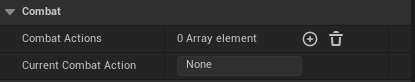

You can add as many Combat actions as you wish, but, there must be ``AT LEAST 1 COMBAT ACTION`` for the ai to work, since the subgoals are dependant on them. The current Combat action that was chosen or current being executed is ``visible`` for playtesting and debugging.

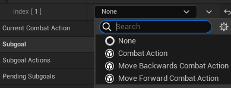

Any ``Combat Action`` class, **be it inherited through C++, Blueprints, or just the base class**, can be placed in the array and and will then be used by thhe subsystem.

#### Subgoal Actions Section

The Goal AI pawn will also grab the ``Subgoal Actions`` or any of it's ``inherited children`` and pick the best one through ``utility`` scores until there's none left.

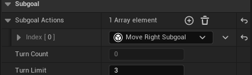

Similar to the ``Combat Actions``, you can add as many ``Subgoal actions`` as you wish, or leave it empty if you want none. Each Subgoal has a ``Turn Cost``, which is counted in the system everytime a Subgoal is executed. You can define the Turn Limit to ajust how many Subgoal actions will be executed before choosing a new ``Combat Action``. The ``Turn Count`` is also visible to help with debugging and playtesting.

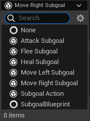

Any ``Subgoal Action`` class, **be it inherited through C++, Blueprints, or just the base class**, can be placed in the array and and will then be used by thhe `subsystem`.

#### Goal AI Pawn State Section

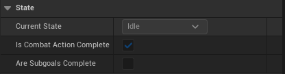

Here are some extra variables that are **visible but not edible**, to help with play testing and indicate which state the Goal Ai pawn is currently in.

### Combat Action

The basic ``Combat Action`` class contains a virtual ``CombatStart`` and ``CombatTick``, in order to define what the ai pawn will do, and it has a ``Weight`` and a ``Name`` which can be set from the editor. CombatStart gets called everytime the Combat Action gets selected, while the CombatTick is the called by the Goal AI pawn's tick whenever this Combat action is in use.

#### From the Editor

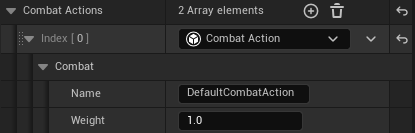

From the editor, the player can set the ``Name`` and ``Weight`` from the instantiated ``Combat Action`` in the ``Goal AI Pawn``. The Name is the name of the combat action, while the Weight defines the likelihood of being chosen when the system selected a main combat goal.

#### Creating an inherited Combat Action through blueprints.

1) Right-click in the Content Browser.

2) Choose Blueprint Class ->  All Classes -> CombatAction 

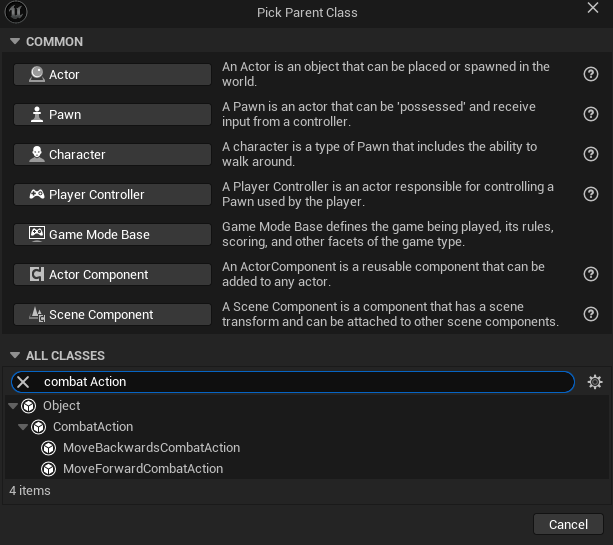

3) In the Blueprint, override ``CombatStart`` and ``ExecuteAction``

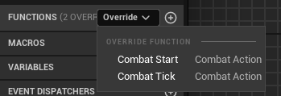

#### Creating an inherited Combat Action through C++

```C++
#pragma once

#include "CoreMinimal.h"
#include "CombatAction.h"
#include "ExampleCombatAction.generated.h"

class AGoalAIPawn;

UCLASS(Blueprintable, EditInlineNew, DefaultToInstanced)
class UExampleCombatAction : public UCombatAction
{
    GENERATED_BODY()

public:
    UExampleCombatAction();
    
    UFUNCTION(BlueprintCallable)
    virtual void CombatStart_Implementation(AGoalAIPawn* AIPawn) override;
    
    UFUNCTION(BlueprintCallable)
    virtual void CombatTick_Implementation(AGoalAIPawn* AIPawn, float DeltaTime) override;
};
```

### Subgoal Action

The basic ``Subgoal Action`` class contains a virtual ``StartSubgoal``, ``TickSubgoal`` and ``CalculateUtility``, in order to define what the ai pawn will do, and it has a ``Weight`` and a ``Name`` which can be set from the editor. StartSubgoal gets called everytime the Subgoal Action gets selected, the TickSubgoal is the called by the Goal AI pawn's tick whenever this Subgoal action in use, and the CalculateUtility is called in order to calculate it's current utility score to see if it is chosen or not.

#### From the Editor

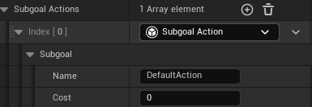

From the editor, the player can set the ``Name`` and ``Cost`` from the instantiated ``Subgoal Action`` in the ``Goal AI Pawn``. The Name is the name of the Subgoal action, while the Cost define how much turn time that subgoal consumes with the limit being the ``TurnLimit`` on the Goal Ai Pawn, which once reached, it start the cycle form scratch.

#### Creating an inherited Subgoal Action through blueprints.

1) Right-click in the Content Browser.

2) Choose Blueprint Class ->  All Classes -> SubgoalAction 

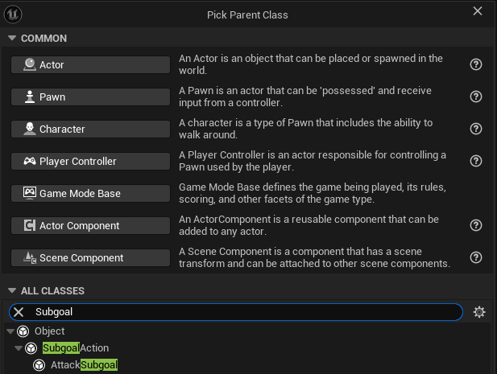

3) In the Blueprint, override ``StartSubgoal``, ``TickSubgoal`` and ``CalculateUtility``

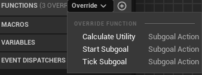

#### Creating an inherited Subgoal Action through C++

```C++
#pragma once

#include "CoreMinimal.h"
#include "SubgoalAction.h"
#include "ExampleSubgoal.generated.h"

class AGoalAIPawn;

UCLASS(Blueprintable, EditInlineNew, DefaultToInstanced)
class UExampleSubgoal : public USubgoalAction
{
    GENERATED_BODY()

public:
    UExampleSubgoal();

    UFUNCTION(Blueprintable)
    virtual void StartSubgoal_Implementation(AGoalAIPawn* AIPawn) override;
    
    UFUNCTION(BlueprintCallable)
    virtual void TickSubgoal_Implementation(AGoalAIPawn* AIPawn, float DeltaTime) override;

    virtual float CalculateUtility_Implementation(AGoalAIPawn* AIPawn) const override;
};
```